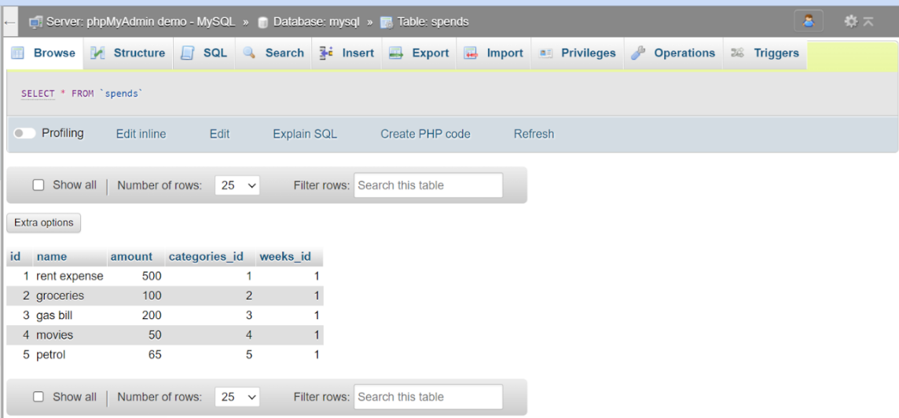

## Title 
Interactive-budget-tracker-application

## Description 
Welcome to the Interactive Budgeting App! This software is intended to help you manage your money successfully by tracking your income, and expenses, and offering insights into your spending patterns. Whether you're planning for personal or commercial costs, this software covers you.

## Features
User-Friendly Design: The app's design is straightforward and intuitive, allowing users to explore and manage their accounts easily.
Track your income and spending easily. Add, amend, and remove transactions as required.
Budgeting: Create weekly budgets for several areas, such as food, transportation, and utilities, and track your expenditures to ensure you remain within your budget.
Interactive Charts: Visualise your financial data using interactive charts and graphs to acquire insights into your spending habits over time.
Customisable Categories: You may tailor income and spending categories to your unique financial requirements and preferences.

## Installation requirements/process
- Clone the repository to your local device using the following command:
git clone <repository_URL>
- Open your terminal and navigate to the project directory.
- Install Express, Node.js, and MySQL2 by running the following command: npm install express node mysql2
- Once the dependencies are installed, start the application by executing: npm run start
- The application will now be running on your local host.
- Alternatively, if you prefer not to set up the application locally, it is also accessible via Heroku.
- That's it! You're now ready to use the application locally or through Heroku.

## Languages used
- CSS
- Javascript
- Handlebars

For our additional technology component, we decided to use chart.js to map our expenses on a bar chart, summed by category field. We used XAMPP to test and run PHP. We needed to use PHP to connect our mysql database with our bar chart, allowing us to display dynamic data inserted into our database. An image of our PHP database is below.

## Deployed link

## ScreenShots
PHP connected with our mysql database and allowed us to generate a bar chart using chart.js.

## License
The Interactive Budget App is licenced under the MIT Licence.
